# Project setup steps

## Main info:

1. Install docker for your operation system (Docker community Edition: CE): https://docs.docker.com/engine/installation/#platform-support-matrix;

2. For using docker without sudo run
    `sudo usermod -aG docker $USER`

## How to setup local development environment (Ubuntu 18.04, 20.04) 
### Prerequisites

  - **Git** is mandatory  
    If it is not installed, please install
    ```
    $ sudo apt update
    $ sudo apt install git
    $ git --version
    ```
  - **Docker** is mandatory  
    If it is not installed, 
    - Install [**Docker**](https://www.digitalocean.com/community/tutorials/how-to-install-and-use-docker-on-ubuntu-20-04)
    ```
    $ sudo apt update
    $ sudo apt install apt-transport-https ca-certificates curl software-properties-common
    $ curl -fsSL https://download.docker.com/linux/ubuntu/gpg | sudo apt-key add -
    $ sudo add-apt-repository "deb [arch=amd64] https://download.docker.com/linux/ubuntu focal stable"
    $ apt-cache policy docker-ce
    $ sudo apt install docker-ce
    ```
    - Install [**Docker Compose**](https://www.digitalocean.com/community/tutorials/how-to-install-and-use-docker-compose-on-ubuntu-20-04)
    ```
    $ sudo curl -L "https://github.com/docker/compose/releases/download/1.29.2/docker-compose-$(uname -s)-$(uname -m)" -o /usr/local/bin/docker-compose
    $ sudo chmod +x /usr/local/bin/docker-compose
    $ docker-compose --version
    ```
  - **make** is mandatory  
    If it is not installed, please install the make package
    ```
    $ sudo apt update
    $ sudo apt install make
    ```  
### Setup environment
1. Create ssh key
    ```
    $ ssh-keygen -t rsa -b 4096 -C "your.email@address.com"
    ```
1. Set up ssh key for [Bitbucket](https://support.atlassian.com/bitbucket-cloud/docs/set-up-personal-ssh-keys-on-windows/#Provide-Bitbucket-Cloud-with-your-public-key)

1. Clone repository
    ```
    $ git clone git@bitbucket.org:r3sourcer_1/endless_project.git
    ```
1. Get into project root
    ```
    $ cd endless_project
    ```
1. Make `.env` from `.env.example`
    ```
    $ cp .env_defaults .env
    ```
   - Set `DJANGO_SECRET_KEY`  
  [Generate](https://django-secret-key-generator.netlify.app/) secrete key  
    ```
    DJANGO_SECRET_KEY=[django secret key]
    ```
   - Set `PRIVATE_REPO_KEY`  
    ```
    PRIVATE_REPO_KEY=~/.ssh/id_rsa
    ```
   - Set `POSTGRES_PASSWORD`  
    ```
    POSTGRES_PASSWORD=[your password]
    ```
1. Create SSH keys for JWT
    ```
    $ mkdir keys && cd keys && ssh-keygen -t rsa -b 2048 -f jwtRS256.key
    ```
1. Make `users.xml` for clickhouse under the project root folder
    ```
    $ make make-users.xml
    ```
1. make `nginx.conf` under the `conf/docker`
    ```
    $ touch conf/docker/nginx.conf
    ```
1. Edit `prod.py`  
    Comment out `sentry_sdk.init`  
    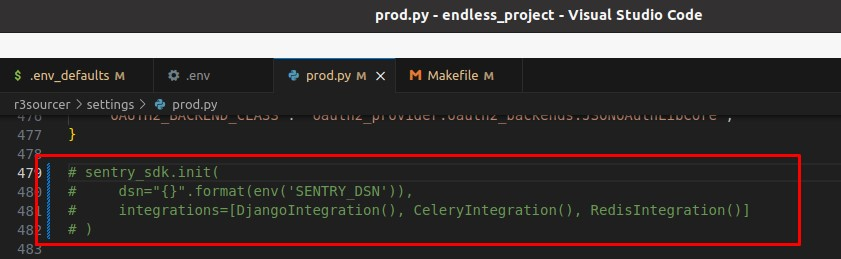
1. Build all containers  
    If it is the first build,
    ```
    $ docker compose -f docker-compose.dev.yml build
    ```
    if not
    ```
    $ docker compose -f docker-compose.dev.yml build --no-cache
    ```    
    If `permission denied` error occurs,  
    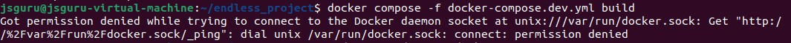
    ```
    $ sudo usermod -a -G docker $USER
    $ su ${USER}
    ```
    and then rerun
    ```
    $ docker compose -f docker-compose.dev.yml build
    ```
    and then run all containers as daemon   
    ```
    $ docker-compose -f docker-compose.dev.yml up -d
    ```
    If `connection refused` error occurs like below,
    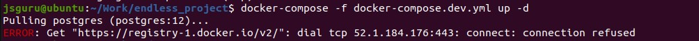  
    Reload daemon then restart docker service
    ```
    $ systemctl daemon-reload
    $ systemctl restart docker
    ```
    Or if `permission denied` error occurs,  
    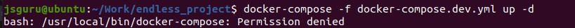 
    ```
    $ sudo chmod +x /usr/local/bin/docker-compose
    ```

1. Create super admin
    ```
    $ docker-compose exec web bash
    # python manage.py createsuperuser
    ```
1. Open django admin page `localhost:8081/admin`
1. Create User  
    Navigate to `http://localhost:8081/core/users/trial/`  
    Fill in all fields like below example and Post
    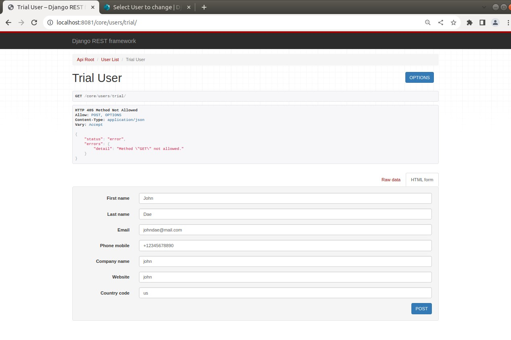
1. Set password
    1. Navigate to `http://localhost:8081/admin/core/user/`
    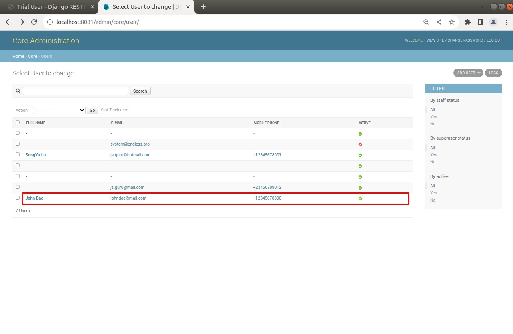
    1. Click just created user
    1. Set password
    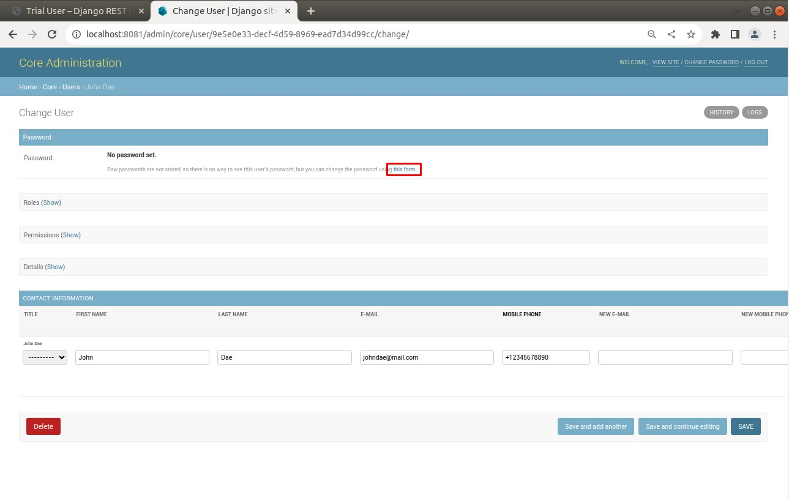
    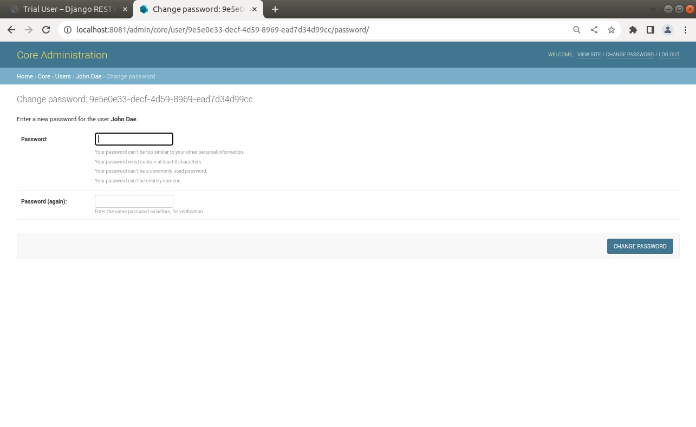
1. Add application
    1. Navigate to `http://localhost:8081/admin/oauth2_provider/application/`
    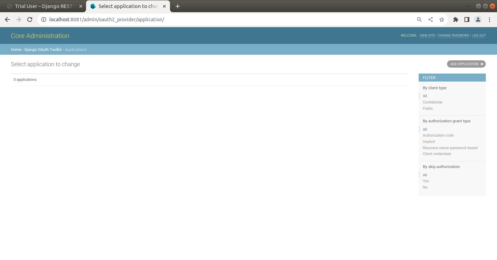
    1. Click Add Applications
    1. Fill in fields
    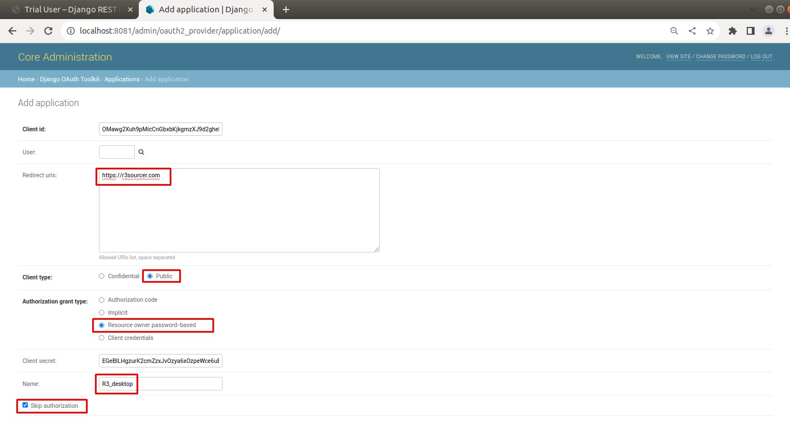
1. Set Front-end to use created USER.  
    Get client id and origin from these two pages in Django Admin and set client id and origin in environment.ts and proxy.conf.json of Front-end.
    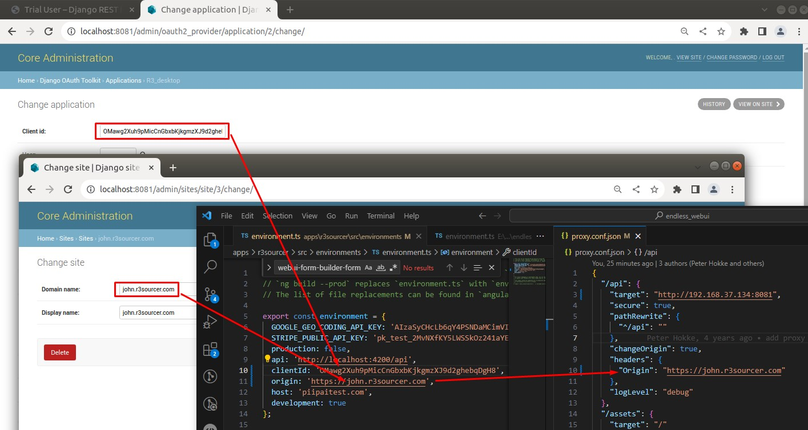
1. Finally you can login front-end with created credential.

### Front-end Local Environment
1. Clone repository
    ```
    $ git clone https://bitbucket.org/r3sourcer_1/endless_webui.git
    ```
2. Get into project root
    ```
    $ cd endless_webui
    ```
3. Install npm packages
    ```
    $ npm install
    ```
4. Edit `proxy.conf.json` and `environment.ts`  
    Set `target` and `Origin` in `proxy.conf.json`
    ```
    {
        "/api": {
            "target": "[back-end url]",
            ...
            "headers": {
                "Origin": "[front-end domain]"
            }
        },
        ...
    }
    ```    
    Set `clientId` and `origin` in `environment.ts`  
    ```
    export const environment = {
        ...
        clientId: '[client id]',
        origin: '[front-end domain]',
        ...
    }
    ```
    If you want to run front-end with back-end staging server, you don't need to edit.
    If you want to run front-end with back-end local server, edit two files like below (example)  
    Refer to 16 of [this section](#setup-environment)
    ```
    {
        "/api": {
            "target": "http://192.168.37.134:8081",
            ...
            "headers": {
                "Origin": "https://john.r3sourcer.com"
            }
        },
        ...
    }
    ```
    ```
    export const environment = {
        ...
        clientId: 'OMawg2Xuh9pMicCnGbxbKjkgmzXJ9d2ghebqDgH8',
        origin: 'https://john.r3sourcer.com',
        ...
    }
    ```
4. Run  
    ```
    $ npm start
    ```
5. Navigate to `http://localhost:4200`

## Development:

1. Generate ssh key for git and add generated public key to your bitbucket ssh keys. Set env PRIVATE_REPO_KEY to the private key's path value (.env file);
2. Generate ssh keys for JWT and add generated keys to "keys" folder in your project root.
3. Run docker-compose -f docker-compose.dev.yml build;
4. Run all containers  as daemon: 
docker-compose -f docker-compose.dev.yml up -d;
5. Stop/Start containers:
docker-compose -f docker-compose.dev.yml stop/start;
6. Check logs from container:
docker-compose -f docker-compose.dev.yml logs -f service_name;

### Helper commands for developers:

1. Createsuperuser: `docker-compose exec web bin/django createsuper`;
2. Migrate: `docker-compose exec web bin/django migrate`;
3. Execute bash commands: `docker-compose exec web ls -la`;
4. Attach to bash: `docker-compose exec web bash`;

# Nginx configuration

For using system Nginx server set env variable `USE_NGINX_DOCKER` to `0` and `NGINX_CONFIG_PATH` to nginx virtualhost file's directory path.

For using Docker nginx server set env variable `USE_NGINX_DOCKER` to `1` (default).

###  Nginx env variables:

* `DOMAIN_NAME` domain name server (`example.com`)
* `USE_TLS` - switch on/off ssl settings from nginx config file (choices: `0`, `1`. Default: `1`).
    * `0` - disable HTTPS;
    * `1` - enable HTTPS.

#### Extra settings:

* `USE_NGINX_DOCKER` - we can use nginx server without docker (choices: `0`, `1`. Default: `1`):
    * `0`- use nginx from system;
    * `1`- use docker nginx;
* `NGINX_CONFIG_PATH` - if you use system nginx server (`USE_NGINX_DOCKER`=0), set `NGINX_CONFIG_PATH` (default: `/etc/nginx/sites-enabled/`; example: `/usr/local/etc/nginx/servers/`).
* `NGINX_VOLUME` - directory which would be mounted to nginx container and used as `conf` and `www` root. Example: `%s/crm/static, %s/crm/media` & `%s/some-r3sourcer/static`, & `%s/some-r3sourcer/media`, etc. We can use system nginx server, see `USE_NGINX_DOCKER` env.
* `DJANGO_STUFF_URL_PREFIX` -  django stuff prefix. Would be used in urls and nginx configuration.
* `DJANGO_DEBUG` - debug mode (choices: `0`, `1`. Default: `1`).
* `CACHE_KEY_PREFIX` - cache key prefix. Would be used for different projects and the same redis container (default: `r3sourcer-cms`).
* `DJANGO_UWSGI_PORT` - used for binding external port to container listening. (Default: `8081`).
* `ALLOWED_HOSTS` - Django ALLOWED_HOSTS setting (https://docs.djangoproject.com/en/1.10/ref/settings/#allowed-hosts), use separator `,` (example test.ru,example.com). (Default: `*`)


# WEB-UI configuration

To use web-ui module set env variable `DJANGO_STUFF_URL_PREFIX`. This variable (`DJANGO_STUFF_URL_PREFIX`) responsible for the django stuff url placement. Web-ui will be available by the root url "/".
For disabling web-ui module set env `DJANGO_STUFF_URL_PREFIX` to the empty value (`DJANGO_STUFF_URL_PREFIX=`).
Example: `DJANGO_STUFF_URL_PREFIX=ecore` (by default) => `/ecore/`, `/ecore/admin`.
This variable used in the Nginx routing configuration.


# Make commands
#### Setup docker app
    make

#### Apply migrations
    make migrate

#### Start develop server
    make runserver

#### Collect static
    make static

### Supervisor
#### Supervisord
    make supervisord

#### Supervisor status
    make supervisor

#### Stop/Restart
    make supervisor-stop
    make supervisor-restart
    make restart-uwsgi
    make restart-celery
    make restart-celerycam
    make restart-celery-beat

#### Start all containers
    make docker-start-all

#### Other commands
    make bash-app
    make shell_plus
    make pip-install


# Tests
#### Run tests
    make tests

#### Run tests locally
    pytest

#### Rut tests with coverage
    make tests_cov

#### Rut tests with coverage locally
    pytest --cov=r3sourcer --cov-report=term-missing
